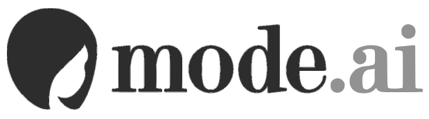
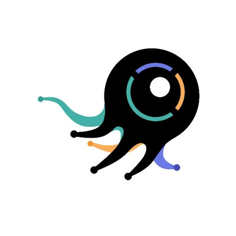

# Cool Fashion Papers 👔👗🕶️🎩
__Cool Fashion Related Papers and Resources (companies, datasets, conference, workshops, ...).__

Papers are ordered in arXiv first version submitting time (if applicable).

Feel free to send a PR or issue.

__TOC__
* [Papers](#papers)
    * [Synthesis](#synthesis)
    * [Classification](#classification)
    * [Recommendation](#recommendation)
    * [Forecast](#forecast)
* [Related Events](#related-events)
* [Datasets](#datasets)
* [Companies](#companies)
* [Other Useful Resources](#other-useful-resources)

## Papers
### Synthesis
| Model | Title | Publication | Paper | Link |
| ----- | ----- | ----------- | ----- | ---- |
| Pose with style | Pose with Style: Detail-Preserving Pose-Guided Image Synthesis with Conditional StyleGAN | SIGGRAPH ASIA 2021 | [[2109.06166]](https://arxiv.org/abs/2109.06166) | [[project]](https://pose-with-style.github.io/) |
| CIT | CIT: Cloth Interactive Transformer for Virtual Try-On | arXiv | [[2104.05519]](https://arxiv.org/abs/2104.05519) | [[Amazingren / CIT]](https://github.com/Amazingren/CIT) |
| VITON-HD | VITON-HD: High-Resolution Virtual Try-On via Misalignment-Aware Normalization | CVPR 2021 | [[2103.16874]](https://arxiv.org/abs/2103.16874) | [[shadow2496 / VITON-HD]](https://github.com/shadow2496/VITON-HD) |
| DCTON | Disentangled Cycle Consistency for Highly-realistic Virtual Try-On | CVPR 2021 | [[2103.09479]](https://arxiv.org/abs/2103.09479) | [[ChongjianGE / DCTON]](https://github.com/ChongjianGE/DCTON) |
| PF-AFN | Parser-Free Virtual Try-on via Distilling Appearance Flows | CVPR 2021 | [[2103.04559]](https://arxiv.org/abs/2103.04559) | [[geyuying / PF-AFN]](https://github.com/geyuying/PF-AFN) |
| SieveNet | SieveNet: A Unified Framework for Robust Image-based Virtual Try-On | WACV 2020 | [[2001.06265]](https://arxiv.org/abs/2001.06265) |  |
|  | Down to the Last Detail: Virtual Try-on with Detail Carving | arXiv | [[1912.06324]](https://arxiv.org/abs/1912.06324) | [[AIprogrammer / Down-to-the-Last-Detail-Virtual-Try-on-with-Detail-Carving]](https://github.com/AIprogrammer/Down-to-the-Last-Detail-Virtual-Try-on-with-Detail-Carving) |
| ClothFlow | ClothFlow: A Flow-Based Model for Clothed Person Generation | ICCV 2019 | [[paper]](http://openaccess.thecvf.com/content_ICCV_2019/papers/Han_ClothFlow_A_Flow-Based_Model_for_Clothed_Person_Generation_ICCV_2019_paper.pdf) |  |
| FW-GAN | FW-GAN: Flow-navigated Warping GAN for Video Virtual Try-on | ICCV 2019 | [[paper]](http://openaccess.thecvf.com/content_ICCV_2019/papers/Dong_FW-GAN_Flow-Navigated_Warping_GAN_for_Video_Virtual_Try-On_ICCV_2019_paper.pdf) |  |
|  | Virtually Trying on New Clothing with Arbitrary Poses | MM 2019 | [[paper]](https://dl.acm.org/citation.cfm?id=3350946) | [[project]](https://fashiontryon.wixsite.com/fashiontryon) |
|  | Generating High-Resolution Fashion Model Images Wearing Custom Outfits | ICCVW 2019 | [[1908.08847]](https://arxiv.org/abs/1908.08847) |  |
| Fashion++ | Fashion++: Minimal Edits for Outfit Improvement | ICCV 2019 | [[1904.09261]](https://arxiv.org/abs/1904.09261) | [[project]](http://vision.cs.utexas.edu/projects/FashionPlus/) |
| MG-VTON | Towards Multi-pose Guided Virtual Try-on Network | arXiv | [[1902.11026]](https://arxiv.org/abs/1902.11026) |  |
| FiNet | Compatible and Diverse Fashion Image Inpainting | ICCV 2019 | [[1902.01096]](https://arxiv.org/abs/1902.01096) |  |
| M2E-Try On Net | M2E-Try On Net: Fashion from Model to Everyone | arXiv | [[1811.08599]](https://arxiv.org/abs/1811.08599) |  |
| FashionGAN | FashionGAN: Display your fashion design using Conditional Generative Adversarial Nets | CG Forum 2018 | [[paper]](https://onlinelibrary.wiley.com/doi/abs/10.1111/cgf.13552) |  |
| PIVTONS | PIVTONS: Pose Invariant Virtual Try-On Shoe with Conditional Image Completion | ACCV 2018 | [[paper]](https://winstonhsu.info/wp-content/uploads/2018/09/chou18PIVTONS.pdf) | [[project]](https://winstonhsu.info/pubs/pivtons-virtual-try-on-shoe/) |
| SwapNet | SwapNet: Image Based Garment Transfer | ECCV 2018 | [[paper]](http://openaccess.thecvf.com/content_ECCV_2018/papers/Amit_Raj_SwapNet_Garment_Transfer_ECCV_2018_paper.pdf) | [[andrewjong / SwapNet]](https://github.com/andrewjong/SwapNet) |
| FiLMedGAN | Language Guided Fashion Image Manipulation with Feature-wise Transformations | ECCVW 2018 | [[1808.04000]](https://arxiv.org/abs/1808.04000) |  |
| CP-VITON | Toward Characteristic-Preserving Image-based Virtual Try-On Network | ECCV 2018 | [[1807.07688]](https://arxiv.org/abs/1807.07688) | [[sergeywong / cp-vton]](https://github.com/sergeywong/cp-vton) |
|  | Disentangling Multiple Conditional Inputs in GANs | ECCVW 2018 | [[1806.07819]](https://arxiv.org/abs/1806.07819) | [[zalandoresearch / disentangling_conditional_gans]](https://github.com/zalandoresearch/disentangling_conditional_gans) |
| DesIGN | DesIGN: Design Inspiration from Generative Networks | ECCVW 2018 | [[1804.00921]](https://arxiv.org/abs/1804.00921) |  |
| VITON | VITON: An Image-based Virtual Try-on Network | CVPR 2018 | [[1711.08447]](https://arxiv.org/abs/1711.08447) | [[xthan / VITON]](https://github.com/xthan/VITON) |
| DVBPR | Visually-Aware Fashion Recommendation and Design with Generative Image Models | ICDM 2017 | [[1711.02231]](https://arxiv.org/abs/1711.02231) | [[kang205 / DVBPR]](https://github.com/kang205/DVBPR) |
| FashionGAN | Be Your Own Prada: Fashion Synthesis with Structral Coherence. | ICCV 2017 | [[1710.07346]](https://arxiv.org/abs/1710.07346) | [[project]](http://mmlab.ie.cuhk.edu.hk/projects/FashionGAN/) |
| CAGAN | The Conditional Analogy GAN: Swapping Fashion Articles on People Images | ICCVW 2017 | [[1709.04695]](https://arxiv.org/abs/1709.04695) |  |

### Classification
| Model | Title | Publication | Paper | Link |
| ----- | ----- | ----------- | ----- | ---- |
| DeepFashion2 | DeepFashion2: A Versatile Benchmark for Detection Pose Estimation Segmentation and Re-Identification of Clothing Images | CVPR 2019 | [[1901.07973]](https://arxiv.org/abs/1901.07973) | [[switchablenorms / DeepFashion2]](https://github.com/switchablenorms/DeepFashion2) |
|  | Brand > Logo: Visual Analysis of Fashion Brands | ECCVW 2018 | [[1810.09941]](https://arxiv.org/abs/1810.09941) |  |
| BCRNN | Attentive Fashion Grammar Network for Fashion Landmark Detection and Clothing Category Classification | CVPR 2018 | [[paper]](http://openaccess.thecvf.com/content_cvpr_2018/papers/Wang_Attentive_Fashion_Grammar_CVPR_2018_paper.pdf) |  |
|  | Studio2Shop: from studio photo shoots to fashion articles | ICPRAM 2018 | [[1807.00556]](https://arxiv.org/abs/1807.00556) |  |
| FashionBrain | FashionBrain Project: A Vision for Understanding Europe's Fashion Data Universe | KDDW 2017 | [[1710.09788]](https://arxiv.org/abs/1710.09788) | [[project]](https://fashionbrain-project.eu/) |
|  | Automatic Spatially-aware Fashion Concept Discovery | ICCV 2017 | [[1708.01311]](https://arxiv.org/abs/1708.01311) | [[xthan / fashion-200k]](https://github.com/xthan/fashion-200k) |
| DFA | Fashion Landmark Detection in the Wild | ECCV 2016 | [[1608.03049]](https://arxiv.org/abs/1608.03049) | [[liuziwei7 / fashion-landmarks]](https://github.com/liuziwei7/fashion-landmarks) |
| FashionNet | DeepFashion: Powering Robust Clothes Recognition and Retrieval with Rich Annotations | CVPR 2016 | [[paper]](http://www.cv-foundation.org/openaccess/content_cvpr_2016/papers/Liu_DeepFashion_Powering_Robust_CVPR_2016_paper.pdf) | [[project]](https://liuziwei7.github.io/projects/DeepFashion.html) |

### Recommendation
| Model | Title | Publication | Paper | Link |
| ----- | ----- | ----------- | ----- | ---- |
|  | Semi-Supervised Visual Representation Learning for Fashion Compatibility | RecSys 2021 | [[2109.08052]](https://arxiv.org/abs/2109.08052) |  |
| POG | POG: Personalized Outfit Generation for Fashion Recommendation at Alibaba iFashion | KDD 2019 | [[1905.01866]](https://arxiv.org/abs/1905.01866) |  |
|  | Aesthetic-based Clothing Recommendation | WWW 2018 | [[1809.05822]](https://arxiv.org/abs/1809.05822) |  |
| CRAFT | CRAFT: Complementary Recommendations Using Adversarial Feature Transformer | ECCVW 2018 | [[1804.10871]](https://arxiv.org/abs/1804.10871) |  |
|  | Learning Type-Aware Embeddings for Fashion Compatibility | ECCV 2018 | [[1803.09196]](https://arxiv.org/abs/1803.09196) |  |
| NeuroStylist | NeuroStylist: Neural Compatibility Modeling for Clothing Matching | MM 2017 | [[paper]](https://dl.acm.org/citation.cfm?id=3123314) |  |
|  | Deep Cross-Domain Fashion Recommendation | RecSys 2017 | [[paper]](https://dl.acm.org/citation.cfm?id=3109861) |  |
|  | An LSTM-Based Dynamic Customer Model for Fashion Recommendation | RecSys 2017 | [[1708.07347]](https://arxiv.org/abs/1708.07347) |  |
|  | Learning Fashion Compatibility with Bidirectional LSTMs | MM 2017 | [[1707.05691]](https://arxiv.org/abs/1707.05691) | [[xthan / polyvore]](https://github.com/xthan/polyvore) |
|  | Fashion DNA: Merging Content and Sales Data for Recommendation and Article Mapping | KDD 2016 | [[1609.02489]](https://arxiv.org/abs/1609.02489) |  |

### Forecast
| Model | Title | Publication | Paper | Link |
| ----- | ----- | ----------- | ----- | ---- |
| Style Quotient | Understanding Fashionability: What drives sales of a style? | KDDW 2018 | [[1806.11424]](https://arxiv.org/abs/1806.11424) |  |
| Sales Potential | Sales Potential: Modelling Sellability of Visual Aesthetics of a Fashion Product | KDDW 2017 | [[paper]](https://kddfashion2017.mybluemix.net/final_submissions/ML4Fashion_paper_10.pdf) |  |
|  | Fashion Forward: Forecasting Visual Style in Fashion | ICCV 2017 | [[1705.06394]](https://arxiv.org/abs/1705.06394) |  |

## Related Events
1. KDD workshop on fashion [[2019]](https://kddfashion2019.mybluemix.net/) [[2018]](https://kddfashion2018.mybluemix.net/) [[2017]](https://kddfashion2017.mybluemix.net/) [[2016]](http://kddfashion2016.mybluemix.net/)
2. Workshop on Computer Vision for Fashion, Art and Design [[CVPR 2020]](https://sites.google.com/view/cvcreative2020) [[ICCV 2019]](https://sites.google.com/view/cvcreative/home) [[ECCV 2018]](https://sites.google.com/view/eccvfashion/) [[ICCV 2017]](https://sites.google.com/zalando.de/cvf-iccv2017/home?authuser=0)
3. NeurlPS workshop on Machine Learning for Creativity and Design [[2019]](https://neurips2019creativity.github.io/) [[2018]](https://nips2018creativity.github.io/) [[2017]](https://nips2017creativity.github.io/)
4. SIGIR Workshop On eCommerce [[2019]](https://sigir-ecom.github.io/index.html) [[2018]](https://sigir-ecom.github.io/ecom2018/index.html) [[2017]](http://sigir-ecom.weebly.com/) 
5. CVPR Deep Learning for Content Creation Tutorial [[2019]](https://nvlabs.github.io/dl-for-content-creation/)
6. iMaterialist Fashion Challenge [[CVPR 2019]](https://sites.google.com/view/fgvc6/competitions/imat-fashion-2019)
7. iDesigner Challenge [[CVPR 2019]](https://sites.google.com/view/fgvc6/competitions/idesigner-2019)
8. FashionGen Challenge [[ICCV 2019, ECCV 2018]](https://fashion-gen.com/)
9. JD AI Fashion Challenge [[ChinaMM 2018]](https://fashion-challenge.github.io/)
10. Alibaba FashionAI Global Challenge [[Tianchi]](http://fashionai.alibaba.com/)
11. Artificial Intelligence on Fashion and Textile Conference [[AIFT 2018]](https://www.polyu.edu.hk/itc/aift2018/)
12. Fashion IQ Challenge [[CVPR 2020]](https://sites.google.com/view/cvcreative2020/fashion-iq?authuser=0) [[ICCV 2019]](https://sites.google.com/view/lingir/fashion-iq)
13. DeepFashion2 Challenge [[CVPR 2020]](https://sites.google.com/view/cvcreative2020/deepfashion2?authuser=0) [[ICCV 2019]](https://sites.google.com/view/cvcreative/deepfashion2)

## Datasets
1. Fashionpedia [[website]](https://fashionpedia.github.io/home/index.html)
2. DeepFashion2 Dataset [[website]](<https://github.com/switchablenorms/DeepFashion2>)
3. DeepFashion Dataset [[website]](http://mmlab.ie.cuhk.edu.hk/projects/DeepFashion.html)
4. FashionGen [[website]](https://fashion-gen.com/)
5. FashionAI [[Tianchi]](http://fashionai.alibaba.com/datasets/?spm=a2c22.11190735.991137.8.501b6d83ilPJsX)
6. TaobaoClothMatch [[Tianchi]](TaobaoClothMatch)
7. Fashion-MNIST [[zalandoresearch/fashion-mnist]](https://github.com/zalandoresearch/fashion-mnist)
8. Fashion IQ [[website]](https://www.spacewu.com/posts/fashion-iq/)

## Companies

| Brand                                        | Name                                                         | Found | Info                                        | News                                                         |
| -------------------------------------------- | ------------------------------------------------------------ | ----- | ------------------------------------------- | ------------------------------------------------------------ |
|      | [Myntra](https://www.myntra.com/)                            | 2007  | Forecast, Synthesis                         | [[2017.11 livemint]](https://www.livemint.com/)              |
|     | [Alibaba 图像和美](https://www.leiphone.com/aiWeights/lab/79) | 2009  | Recognition                                 | [[2018.7 FashionAI]](https://www.leiphone.com/news/201807/Bp6UlbXIab29rIN6.html) |
|   | [STITCH FIX](https://www.stitchfix.com/), [BLOG](https://multithreaded.stitchfix.com/blog/) | 2011  | Personalization                             | [[2018.5 Forbes]](https://www.forbes.com/sites/bernardmarr/2018/05/25/stitch-fix-the-amazing-use-case-of-using-artificial-intelligence-in-fashion-retail/#5d5ff05c3292) |
|   | [Heuritech](https://www3.heuritech.com/)                     | 2013  | Forecast, Recognition                       | [[2019.1 Fashnerd]](https://fashnerd.com/2019/01/french-startup-heuritech-wants-to-help-fashion-brands-make-clothes-that-customers-want/) |
|       | [Yi+](http://www.dressplus.cn/home)                          | 2014  | Recognition                                 | [[2018.8 funding]](https://pe.pedaily.cn/201808/434505.shtml) |
|      | [MALONG TECHNOLOGIES](http://www.malong.com/en/home)         | 2014  | Recognition                                 | [[2018.7 Forbes]](https://www.forbes.com/sites/bernardmarr/2018/07/09/14-incredible-artificial-intelligence-pioneers-everyone-should-know-about/#7a23aaaa5626) |
|        | [syte](https://www.syte.ai/)                                 | 2015  | Recognition                                 | [[2018.12 co-op w/ farfetch]](https://techstartups.com/2018/12/07/visual-ai-startup-syte-partners-luxury-fashion-platform-farfetch-launch-new-app-visual-search-feature-ios/) |
|   | [GrokStyle](https://www.grokstyle.com/) (2019.2 acquired by [Facebook](https://www.facebook.com/)) | 2015  | Searching                                   | [[2019.2 acquired by Facebook]](https://venturebeat.com/2019/02/08/facebook-acquires-visual-search-startup-grokstyle/) |
|     | [Zalando Research](https://research.zalando.com/)            | 2016  | Research                                    | [[2016.10 founding]](https://earlymoves.com/2016/10/07/zalando-research-is-shaping-the-future-of-online-fashion/) |
|      | [MatchU 码尚](https://www.immatchu.com/)                     | 2016  | Modeling                                    | [[2018.12 funding]](http://www.iheima.com/article-195955.html) |
|      | [mode.ai](https://mode.ai/#/about)                           | 2016  | Recognition, NLP, Searching                 | [[2018.5 TechRepublic]](https://www.techrepublic.com/article/how-mode-ai-powers-personalized-shopping-experiences-via-chatbot/) |
|  | [Markable.AI](https://markable.ai/)                          | 2016  | Recognition, Searching                      | [[2018.7 journal sentinel]](https://www.jsonline.com/story/money/business/2018/07/26/shazam-fashion-markable-app-shops-comparable-outfits/816175002/) |
|        | [衣呼 YIHU (TOZI)](https://www.emtailor.com/solutions)       | 2017  | 3D Modeling                                 | [[2018.9 funding]](https://www.lieyunwang.com/archives/447739) |
|       | [macty.eu](https://www.macty.eu/)                            | 2017  | Recognition, Searching, Recommendation, NLP | [[2018.12 START IT]](https://startitkbc.prezly.com/complete-the-look-tool-macty-leverages-ai-to-revolutionise-the-fashion-industry) |
|                                              | [极睿 infimind](http://infimind.com/)                        | 2017  |                                             |                                                              |
|                                              | [知衣 zhiyi](https://www.zhiyitech.cn/)                      | 2018  |                                             |                                                              |
|      | [glitch-ai](https://glitch-ai.com/)                          | 2019  | AI Design                                   | [[2019.6 news]](https://www.vice.com/en_us/article/vb9pgm/this-clothing-line-was-designed-by-ai) |
|   | [深尚科技 StylingAI](https://shenshangtech.com/)             | 2019  | AI Design                                   | [[2020.1 news]](https://36kr.com/p/5281004)                  |

## Other Useful Resources
1. [[ayushidalmia/awesome-fashion-ai]](https://github.com/ayushidalmia/awesome-fashion-ai)
2. [[lzhbrian/image-to-image-papers]](https://github.com/lzhbrian/image-to-image-papers)

