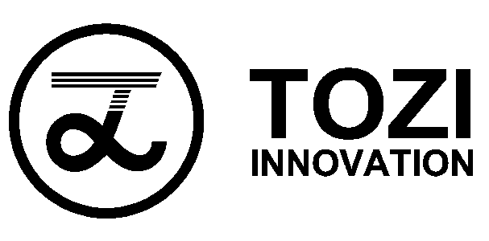

## Companies

| Brand                                       | Name                                                         | Found | Info                | News                                                         |
| ------------------------------------------- | ------------------------------------------------------------ | ----- | ------------------- | ------------------------------------------------------------ |
|     | [Myntra](https://www.myntra.com/)                            | 2007  | Forecast, Synthesis | [[2017.11 livemint]](https://www.livemint.com/)              |
|    | [Alibaba 图像和美](https://www.leiphone.com/aiWeights/lab/79) | 2009  | Recognition         | [[2018.7 FashionAI]](https://www.leiphone.com/news/201807/Bp6UlbXIab29rIN6.html) |
|  | [STITCH FIX](https://www.stitchfix.com/)                     | 2011  | Personalization     | [[2018.5 Forbes]](Stitch Fix: The Amazing Use Case Of Using Artificial Intelligence In Fashion Retail) |
|      | [Yi+](http://www.dressplus.cn/home)                          | 2014  | Recognition         | [[2018.8 funding]](https://pe.pedaily.cn/201808/434505.shtml) |
|     | [MALONG TECHNOLOGIES](http://www.malong.com/en/home)         | 2014  | Recognition         | [[2018.7 Forbes]](https://www.forbes.com/sites/bernardmarr/2018/07/09/14-incredible-artificial-intelligence-pioneers-everyone-should-know-about/#7a23aaaa5626) |
|       | [syte](https://www.syte.ai/)                                 | 2015  | Recognition         | [[2018.12 co-op w/ farfetch]](https://techstartups.com/2018/12/07/visual-ai-startup-syte-partners-luxury-fashion-platform-farfetch-launch-new-app-visual-search-feature-ios/) |
|  | [GrokStyle](https://www.grokstyle.com/) (2019.2 acquired by [Facebook](https://www.facebook.com/)) | 2015  | Visual Searching    | [[2019.2 acquired by Facebook]](https://venturebeat.com/2019/02/08/facebook-acquires-visual-search-startup-grokstyle/) |
|    | [Zalando Research](https://research.zalando.com/)            | 2016  | Research            | [[2016.10 founding]](https://earlymoves.com/2016/10/07/zalando-research-is-shaping-the-future-of-online-fashion/) |
|     | [MatchU 码尚](https://www.immatchu.com/)                     | 2016  | Modeling            | [[2018.12 funding]](http://www.iheima.com/article-195955.html) |
|       | [衣呼 YIHU (TOZI)](https://www.emtailor.com/solutions)       | 2017  | 3D Modeling         | [[2018.9 funding]](https://www.lieyunwang.com/archives/447739) |

